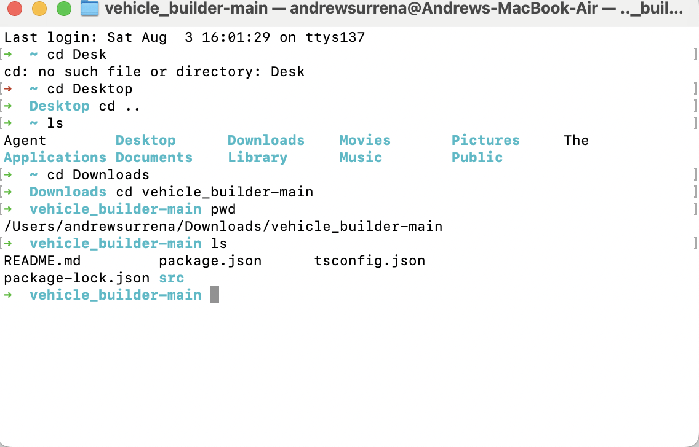

# Vehicle Builder

## Description

Welcome to the Vehicle Builder App. With this app, you'll be able to enter basic vehicle information, store it to a list of vehicles, and choose from a list of actions to perform with your vehicle.

While working on this project, I was able to practice TypeScript in addition to the Inquirer module. In using Type Script, I was able to practice using such features as Interfaces, Classes, Inheritence, Polymorphism, and Composition.

## Table of Contents
- [Installation](#installation)
- [Usage](#usage)
- [Credits](#credits)

## Installation

To install the Vehicle Builder application, simply download the vehicle_builder directory from github - [Click to access repo](https://github.com/andrew-surrena/vehicle_builder)


Click "Download ZIP" to access folder

## Usage

To utilize app, start by accessing the folder in your terminal:



Next, download the necessary modules by running the line: 
```
npm i
```

Now, you can run the application by running the line:
```
npm run start
```

Answer the prompts provided to create a new vehicle or select from a pre-loaded list of existing vehicles of which you can perform actions on.

### Access video demo: 

* https://youtu.be/lycbcbnct08

## Credits
Special thanks to the following instructors for their help:
* Leif Hetland
* Daniel Ceballos

Starter Code provided by:
* edX Boot Camps LLC

The following technologies were used:
* Inquirer
* TypeScript

## Questions/How to Contribute

If you have any questions please reach out to me at andrewsurrena@gmail.com

You can find my other projects on my github page at https://github.com/andrew-surrena